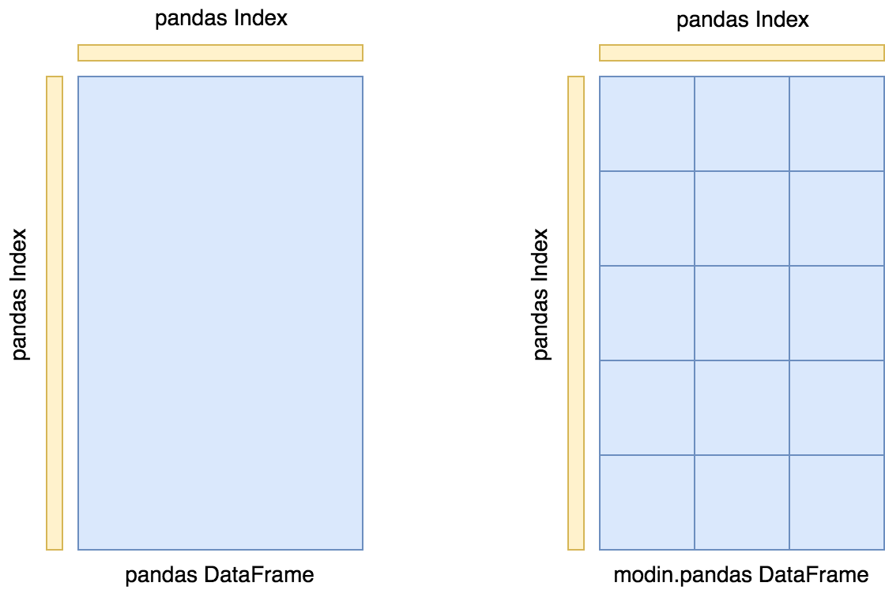
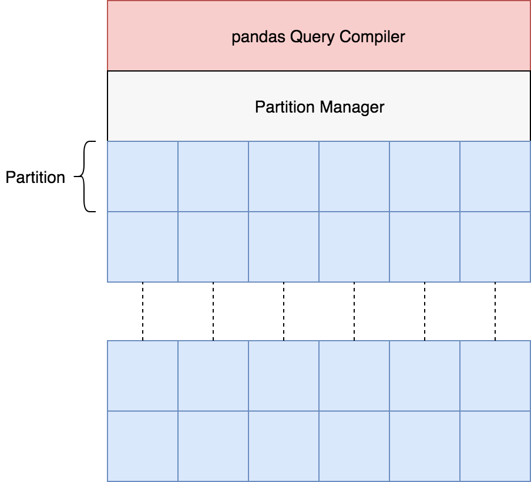

Architecture
============

In this documentation page, we will lay out the overall architecture for Modin, as well
as go into detail about the implementation and other important details. This document
also contains important reference information for those interested in contributing new
functionality.

DataFrame Partitioning
----------------------

The Modin DataFrame architecture follows in the footsteps of modern architectures for
Database and high performance matrix systems. We chose a partitioning schema that
partitions along both columns and rows. This gives us flexibility and scalability in
both the number of columns and the number of rows we can support. The following figure
illustrates this concept.

Currently, each partition is backed by a pandas DataFrame. In the future, we will
support additional in-memory formats for the backend, namely `Arrow tables`_.

Index
"""""

We currently use the ``pandas.Index`` object for both indexing columns and rows. In the
future, we will implement a distributed, pandas compatible Index object in order remove
this scaling limitation from the system. It does not start to become a problem until you
are operating on more than 10's of billions of columns or rows, so most workloads will
not be affected by this scalability limit. **Important note**: If you are using the
default index (``pandas.RangeIndex``) there is a fixed memory overhead (~200 bytes) and
there will be no scalability issues with the index.

System Architecture
-------------------

The figure below outlines the general architecture for the implementation of Modin.

Modin is logically separated into different layers that represent the hierarchy of a
typical Database Management System. At the highest layer, we expose the pandas API. This
is discussed in many other parts of the documentation, so we will not go into detail for
it here. We will go through all of the other components in some detail below, starting
with the next highest layer, the Query Compiler.

Query Compiler
""""""""""""""

The Query Compiler receives queries from the pandas API layer. The API layer's
responsibility is to ensure clean input to the Query Compiler. The Query Compiler must
have knowledge of the in-memory format of the data (currently a pandas DataFrame) in
order to efficiently compile the queries.

The Query Compiler is responsible for sending the compiled query to the Partition
Management layer. In this design, the Query Compiler does not need to know what the
execution framework is (Ray_ in this case), and gives the control of the partition
layout to a lower layer.

At this layer, operations can be performed lazily. Currently, Modin executes most
operations eagerly in an attempt to behave as pandas does. Some operations, e.g.
``transpose`` are expensive and create full copies of the data in-memory. In these
cases, we manipulate some metadata to perform that operation when another operation is
performed. In the future, we plan to add some query planning and laziness to Modin to
ensure that queries are performed efficiently.

.. _Arrow tables: https://arrow.apache.org/docs/python/generated/pyarrow.Table.html
.. _Ray: https://github.com/ray-project/ray