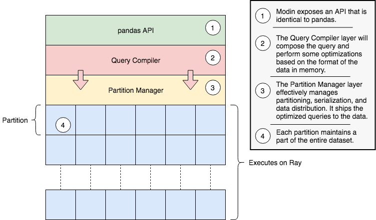

Architecture
============

In this documentation page, we will lay out the overall architecture for Modin, as well
as go into detail about the implementation and other important details. This document
also contains important reference information for those interested in contributing new
functionality.

DataFrame overall architecture
------------------------------

The ``modin.pandas`` architecture follows in the footsteps of modern architectures for
Database and high performance matrix systems. Similar to the more mature distributed
data management systems, we use a partitioning schema that partitions along both columns
and rows. This gives us flexibility and scalability in both the number of columns and
the number of rows. The following figure illustrates this concept.

We currently use the ``pandas.Index`` object for both indexing columns and rows. In the
future, we will implement a distributed, pandas compatible Index object in order remove
this scaling limitation from the system. It does not start to become a problem until you
are operating on more than 10's of billions of columns or rows, so most workloads will
not be affected by this scalability limit. **Important note**: If you are using the
default index (``pandas.RangeIndex``) there is a fixed memory overhead (~200 bytes) and
there will be no scalability issues with the index.

The figure below outlines the general architecture for the implementation of Modin.

